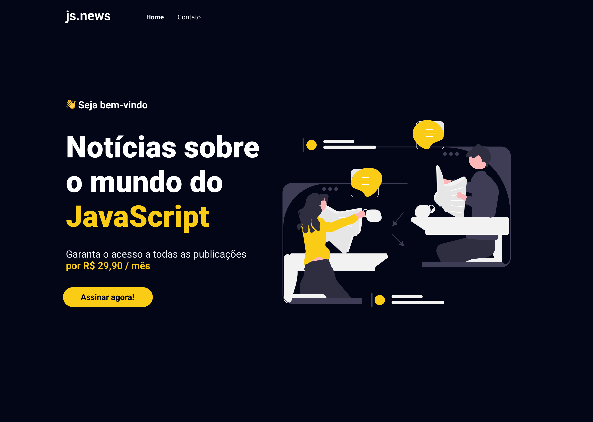

# JS.NEWS
## Projeto utilizando o framework W3.CSS 

Acesse: https://alvarosena.github.io/projeto-2/

Página desenvolvida com o framework W3.CSS destinado ao segundo projeto da disciplina de WEB 1.

<strong>Adendo: </strong> para melhor responsividade e adaptação para diferentes modelos de tela, um dos requisitos da avaliação, foi necessário utilizar um CSS customizado com o incentivo da própria documentação da biblioteca como está previsto aqui (https://www.w3schools.com/w3css/w3css_versions.asp), pois a biblioteca, como se apresenta, é bem primitiva e anterior aos novos recursos do CSS.

### Começando
```
$ git clone https://github.com/AlvaroSena/projeto-2.git

$ cd projeto-2
```